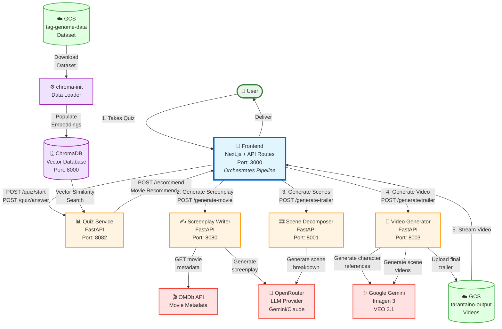

# System Architecture Diagram



## Key Changes from Previous Architecture

**Pipeline Orchestration Now Handled by Frontend:**
- The `pipeline2.py` orchestrator has been removed
- Frontend (Next.js) now directly orchestrates the microservices pipeline
- Frontend API routes handle the sequential calls to backend services

## Pipeline Flow

1. **Quiz Phase**: User answers questions → Frontend calls Quiz Service
2. **Recommendations**: Frontend requests recommendations from Quiz Service
3. **Screenplay Generation**: Frontend calls Screenplay Writer with recommendations
4. **Scene Breakdown**: Frontend sends screenplay to Scene Decomposer
5. **Video Generation**: Frontend triggers Video Generator with scene breakdown
6. **Delivery**: Frontend polls GCS for completed video and streams to user

## Advantages of Frontend Orchestration

- **Simplified Architecture**: One less service to deploy and maintain
- **Better User Experience**: Frontend can show real-time progress updates
- **Easier Debugging**: All orchestration logic visible in one place
- **Reduced Latency**: No intermediate service hop
- **State Management**: Frontend naturally manages user session state

## Frontend API Routes Structure

```
frontend/app/api/
├── quiz/
│   ├── start/route.ts          # Proxy to Quiz Service
│   ├── answer/route.ts         # Proxy to Quiz Service
│   └── recommend/route.ts      # Proxy to Quiz Service
└── generate/
    └── route.ts                # Orchestrates full pipeline:
                                # 1. Call Screenplay Writer
                                # 2. Call Scene Decomposer
                                # 3. Call Video Generator
                                # 4. Return GCS URL
```
