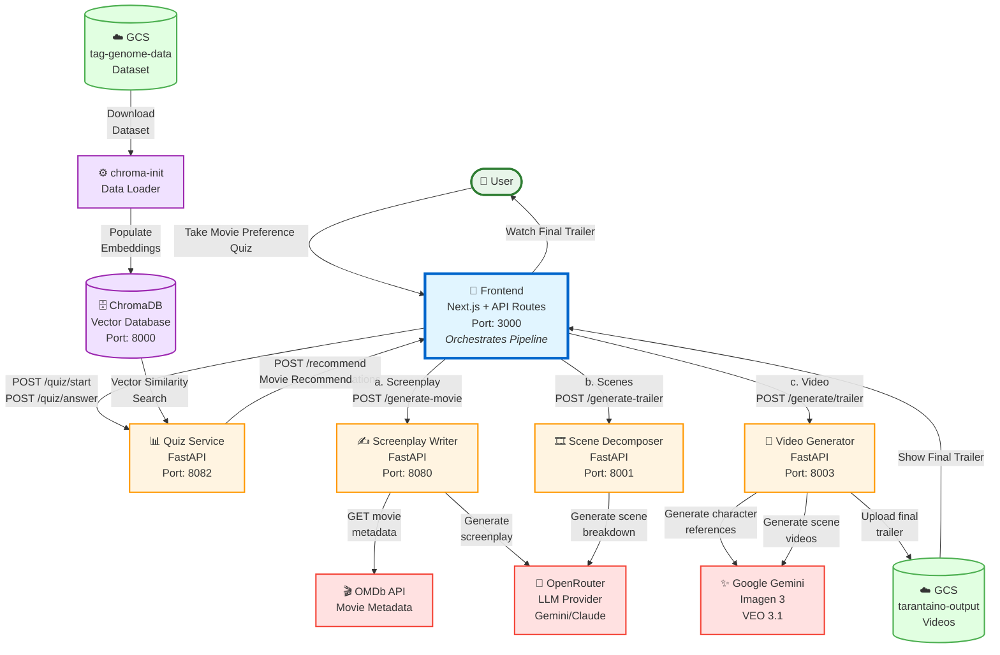

# System Architecture Diagram

# System Architecture Overview
Frontend API routes handle sequential calls to backend services:
1. **Quiz Phase**: User answers questions → Quiz Service builds taste vector
2. **Recommendations**: Frontend gets movie recommendations from Quiz Service
3. **Screenplay Generation**: Frontend calls Screenplay Writer with recommendations
4. **Scene Breakdown**: Frontend sends screenplay to Scene Decomposer
5. **Video Generation**: Frontend triggers Video Generator with scene breakdown
6. **Delivery**: Frontend polls GCS and streams completed video to user